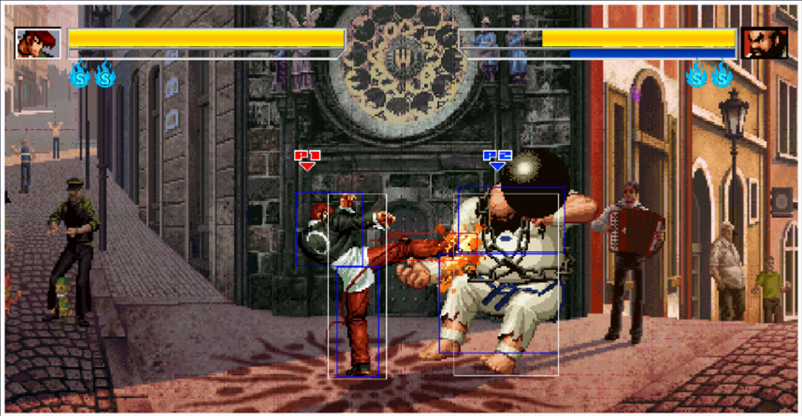
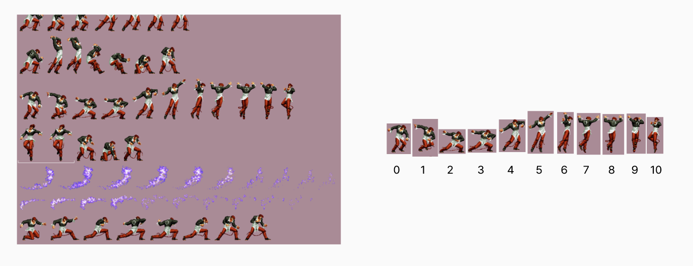
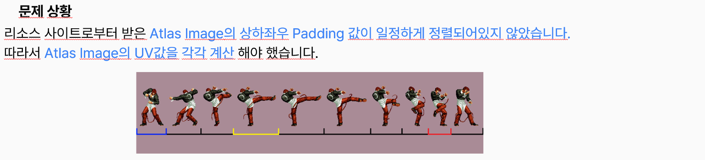
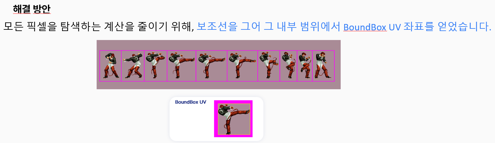
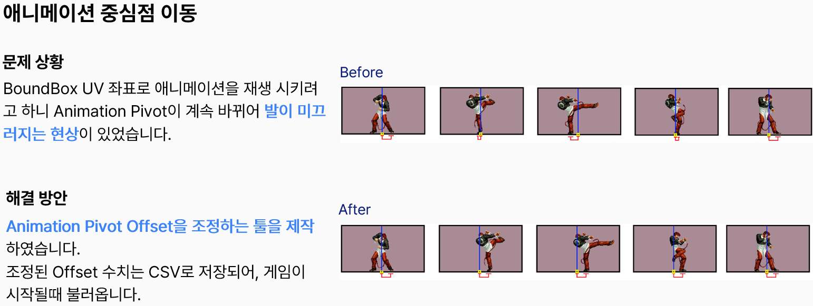
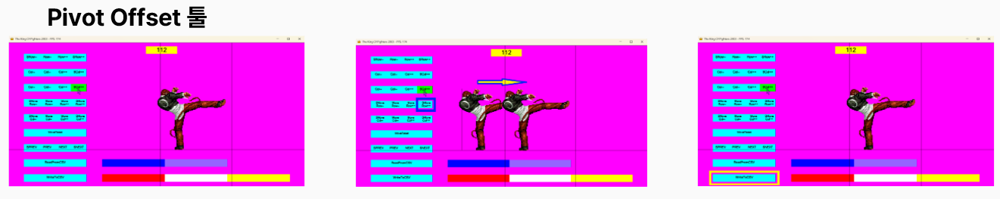
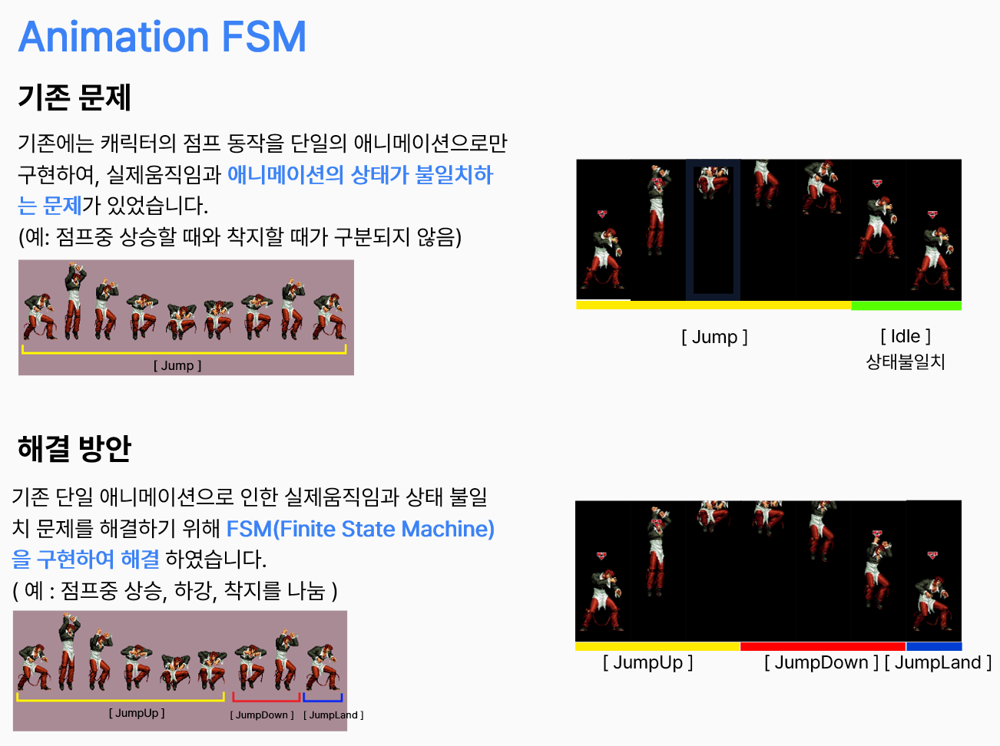
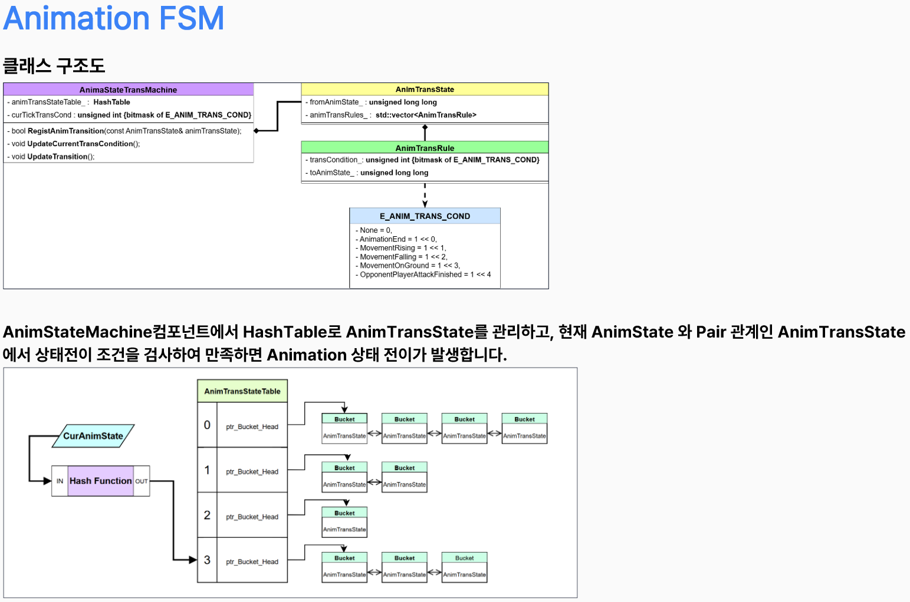
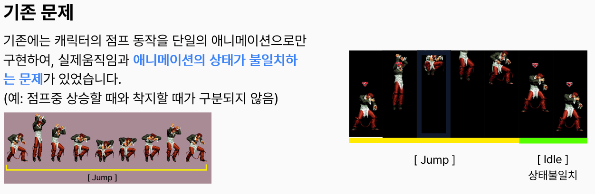
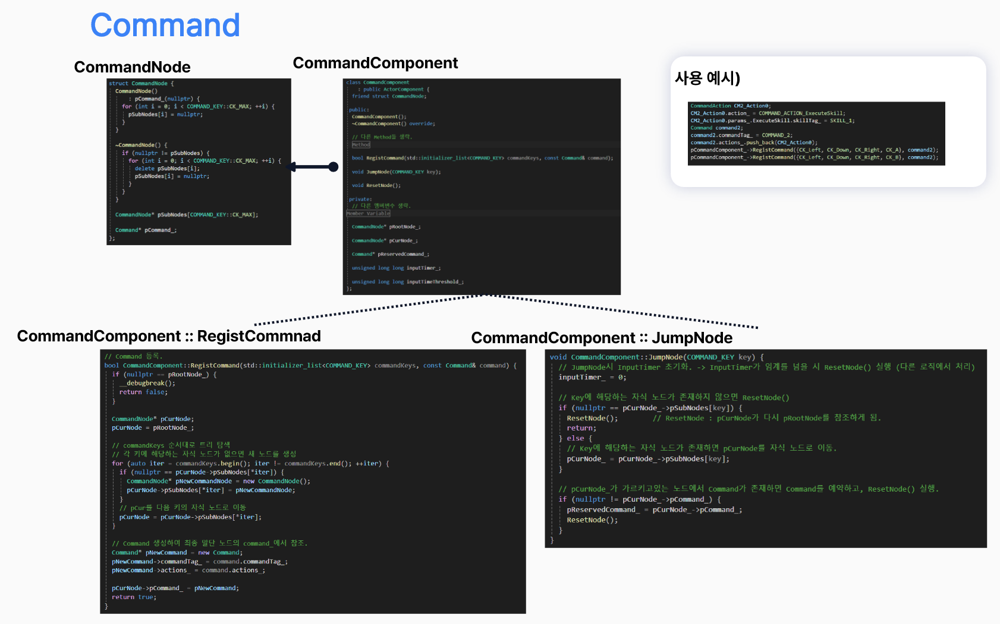

<h2>🥊 King of Fighters 2003 (모작) - Win32 2D Game Framework</h2>

  <h3>
    
    King of Fighters 2003 Demo
  </h3>

  

  
<i>이미지를 클릭하시면 유튜브 데모 영상으로 이동합니다.</i>

   
  본 프로젝트는 상용 엔진 없이 C/C++, Win32 API를 사용하여 간단한 2D 게임 프레임워크를 제작하고, 
  그 프레임워크 위에서 동작하는 King of Fighters 2003을 모작한 개인 프로젝트입니다.

<!-- 기술스택 -->

  

 

  <b>Team Size</b> : 개인 프로젝트 &nbsp;|&nbsp; <b>Dev Period</b> : 2025.03 ~ 2025.08

 
 

## 🚀 구현 기능

  <h3>Atlas Animation</h3>

  

   
  스프라이트 아틀라스를 활용하여 애니메이션을 구현했습니다. 
  단일 텍스처에서 UV 좌표를 계산해 원하는 이미지 인덱스로 전환하는 방식으로 애니메이션 시스템을 제작했습니다.

 
 

#### 🚨 문제 상황
* 리소스 사이트로부터 받은 Atlas Image의 상하좌우 Padding 값이 일정하게 정렬되어 있지 않았습니다.
* 따라서 Atlas Image의 UV 값을 각각 계산해야 했습니다.

  

 

#### 💡 해결 방안
* 모든 픽셀을 탐색하는 계산을 줄이기 위해, <b>보조선을 그어 그 내부 범위에서 BoundBox UV 좌표</b>를 얻었습니다.

  
    
  
  
<i>보조선 내부에서 얻은 BoundBox UV</i>

  

---

  <h3>
    
    🚨 문제 - 애니메이션 발 미끄러짐 현상 해결 (Pivot Offset)
  </h3>

  

  
<i>이미지를 클릭하시면 유튜브 데모 영상으로 이동합니다.</i>

 

  
  
<i>Pivot Offset 조정 툴 제작</i>

  

---

---

  <h3>🚨 문제 - 캐릭터의 실제 움직임과 애니메이션 상태의 불일치</h3>

  

   
  캐릭터의 실제 움직임과 애니메이션 상태를 일치시키기 위해 <b>FSM(Finite State Machine)</b>을 구현했습니다.

 

  

<b>AnimStateTransMachine:</b> HashTable로 AnimTransState를 관리하는 컴포넌트입니다. 
<b>AnimTransState:</b> 현재 AnimState를 Key로 검색되며, 해당 상태에서 전이 가능한 AnimTransRule 목록을 가집니다. 
<b>AnimTransRule:</b> 비트마스크로 된 전이 조건(E_ANIM_TRANS_COND)과 전이할 AnimState를 가집니다. 매 Tick 전이 조건을 만족하면 애니메이션 상태 전이가 발생합니다. 

  

<!-- ---

#### 🚨 기존 문제
* 캐릭터의 점프 동작을 단일 애니메이션으로만 구현하여, 실제 움직임과 애니메이션 상태가 일치하지 않았습니다.
* 예를 들어 점프 중 상승할 때와 착지할 때가 구분되지 않았습니다.

  <h3>Animation FSM</h3>

  

   
  캐릭터의 실제 움직임과 애니메이션 상태를 일치시키기 위해 <b>FSM(Finite State Machine)</b>을 구현했습니다.

 

#### 💡 해결 방안
* FSM을 구현하여 점프를 <code>JumpUp</code>, <code>JumpDown</code>, <code>JumpLand</code>로 나누었습니다.

  

<b>AnimStateTransMachine:</b> HashTable로 AnimTransState를 관리하는 컴포넌트입니다. 
<b>AnimTransState:</b> 현재 AnimState를 Key로 검색되며, 해당 상태에서 전이 가능한 AnimTransRule 목록을 가집니다. 
<b>AnimTransRule:</b> 비트마스크로 된 전이 조건(E_ANIM_TRANS_COND)과 전이할 AnimState를 가집니다. 매 Tick 전이 조건을 만족하면 애니메이션 상태 전이가 발생합니다. 

   -->
---

  <h3>Collision</h3>

  

   
  플레이어 간 충돌을 처리하기 위해 <b>AABB(사각형) 충돌</b>을 구현했습니다. 
  또한 애니메이션마다 충돌 범위를 지정하기 위해 <b>충돌 에디터 툴</b>을 제작하여 충돌 범위를 지정했습니다.

  

---

  <h3>Command</h3>

  

   
  King of Fighters 2003에는 지정된 Command를 입력하면 해당 스킬이 나가는 Command 입력 시스템이 있습니다. 
  Command 검색을 위해 <b>Tree 구조</b>를 사용하여 Command 기능을 구현했습니다.

 

<b>RegistCommand:</b> 입력 키 순서대로 트리를 탐색하고, 키에 해당하는 자식 노드가 없으면 새 노드를 생성합니다. 마지막 노드에 Command를 연결합니다. 
<b>JumpNode:</b> 입력된 키에 해당하는 자식 노드로 이동합니다. 자식 노드가 없으면 루트 노드로 돌아갑니다. 이동한 노드에 Command가 있으면 Command를 예약하고 루트 노드로 돌아갑니다. 
<b>Input Timer:</b> 키 입력 간격이 임계값을 넘으면 루트 노드로 초기화됩니다. 

  
