

<h2>🥊 King of Fighters 2003 (모작) - Win32 2D Game Framework</h2>

  <h3>
    
    King of Fighters 2003 Demo
  </h3>

  

  
<i>이미지를 클릭하시면 유튜브 데모 영상으로 이동합니다.</i>

   
  상용 엔진 없이 C/C++와 Win32 API로 2D 게임 프레임워크를 직접 제작하고, 
  그 위에서 동작하는 King of Fighters 2003을 모작한 개인 프로젝트입니다. 

<!-- 기술스택 -->

  

 

  <b>Team Size</b> : 개인 프로젝트 &nbsp;|&nbsp; <b>Dev Period</b> : 2025.03 ~ 2025.08

 
 

## 🚀 구현 기능

#### 🛠️ 구현 - Atlas Animation
* 스프라이트 아틀라스를 활용해, 단일 텍스처에서 UV 좌표를 계산하고 이미지 인덱스를 전환하는 방식으로 애니메이션을 구현했습니다.

  <h3>Atlas Animation</h3>
  

 
 

#### 🚨 문제 상황 - 효율적인 프레임 UV 좌표 탐색
* 리소스 사이트로부터 받은 Atlas Image의 상하좌우 Padding 값이 일정하게 정렬되어 있지 않았습니다.
* 따라서 Atlas Image의 UV 값을 프레임마다 각각 계산해야 했습니다.
* 또한 픽셀을 탐색해 UV 좌표를 구하면, 한 프레임 안에 빈 공간이 있을 때 이를 별개의 프레임으로 인식해 올바른 UV 값을 구할 수 없었습니다.

  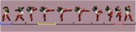

 

#### 💡 해결 방안 - 보조선을 그어 불필요한 계산 생략
* 모든 픽셀을 탐색하는 대신, <b>보조선을 그어 그 내부 범위에서 BoundBox UV 좌표</b>를 얻었습니다.

  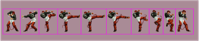
    
  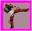
  
<i>보조선 내부에서 얻은 BoundBox UV</i>

  

---

#### 🚨 문제 상황 - 애니메이션 발 미끄러짐 현상
* BoundBox UV 좌표로 애니메이션을 재생하면, 프레임마다 <b>Animation Pivot이 달라져 애니메이션의 발이 미끄러지는 현상</b>이 발생했습니다.

  <h3>
    
    Pivot Offset Before / After
  </h3>

  <a href="https://youtube.com/shorts/CDv2IbMH8_U?si=uwe0s13LtzgfGdS4" target="_blank">
    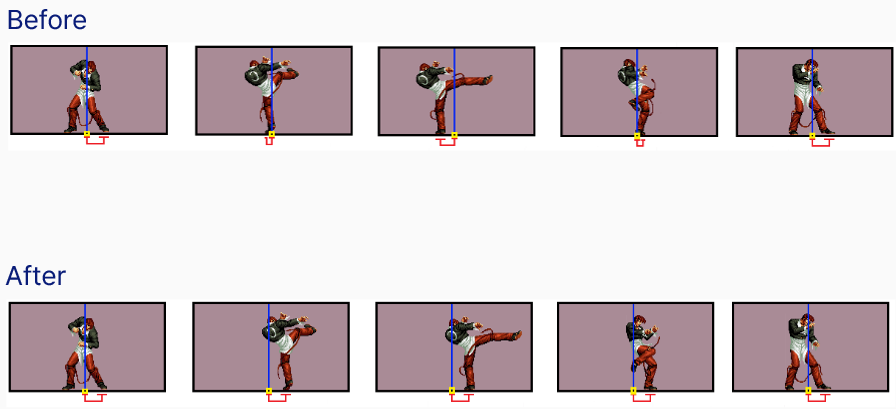
  </a>

  
<i>이미지를 클릭하시면 유튜브 데모 영상으로 이동합니다.</i>

 

#### 💡 해결 방안 - Pivot Offset 툴 제작
* 프레임별 Pivot Offset을 조정하는 <b>Pivot Offset 툴을 제작</b>하였습니다.
* 조정한 Offset 값은 CSV로 저장되고, 게임 시작 시 불러와 적용됩니다.

  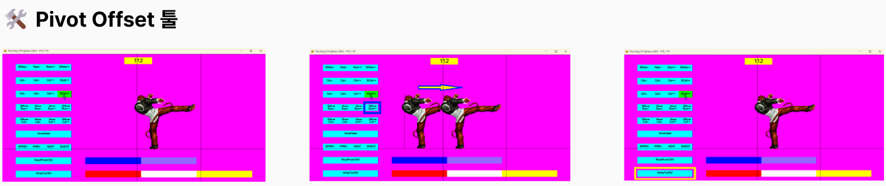
  
<i>Pivot Offset 툴</i>

  

---

#### 🛠️ 구현 - Animation FSM
* <b>FSM(Finite State Machine)</b>을 구현하여 애니메이션 상태를 관리했습니다.

 

#### 🚨 문제 상황 - 캐릭터의 실제 움직임과 애니메이션 상태 불일치
* 점프 동작이 하나의 애니메이션으로만 구현되어 있어, 상승과 착지 구간이 구분되지 않았습니다.
* 이로 인해 <b>캐릭터의 실제 움직임과 애니메이션 상태가 일치하지 않았습니다.</b>

  

 

#### 💡 해결 방안 - FSM으로 점프 상태 분리
* FSM(Finite State Machine)을 구현해 애니메이션 상태를 관리했습니다.
* 점프를 <b>상승(JumpUp), 하강(JumpDown), 착지(JumpLand)</b> 상태로 나누고, 캐릭터의 움직임에 따라 각 상태로 전환되도록 했습니다.

  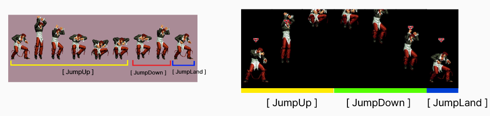

 

#### 📐 구조도
* AnimStateTransMachine 컴포넌트는 <b>HashTable로 AnimTransState를 관리</b>하며, 현재 AnimState에 해당하는 AnimTransState의 <b>전이 조건을 만족하면 애니메이션 상태를 전환</b>합니다.

  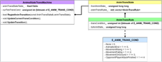

  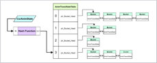

 
  

---

#### 🛠️ 구현 - AABB(사각형) Collision
* 플레이어 간 충돌을 처리하기 위해 <b>AABB 사각형 충돌</b>을 구현하였습니다.

  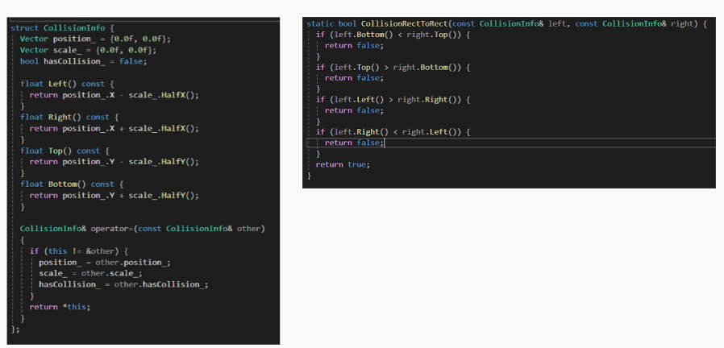

  

 

#### 🛠️ 구현 - 충돌 에디터 툴 제작
* 애니메이션마다 충돌 범위를 지정하기 위해 <b>충돌 에디터 툴을 제작하여 충돌 범위를 지정</b>하였습니다.

  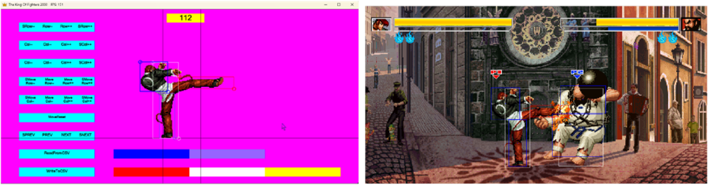

  

---

#### 🛠️ 구현 - Tree 구조를 이용한 Command 시스템
* King of Fighters 2003은 전통 2D 게임의 필수 요소인 Command 입력 시스템이 존재합니다.
* 플레이어가 지정된 Command를 차례로 입력하면 해당 스킬이 나가게 됩니다.
* <b>Tree 구조를 이용하여 Command 시스템을 구현</b>하였습니다. Tree 구조로 Command를 구현하여 <b>시간 복잡도 O(1)로 Command 상태를 탐색</b>할 수 있습니다.

  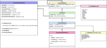

  

 

#### 📝 Code
* <b>RegistCommand</b> : commandKeys 순서대로 트리를 탐색하고, 각 키에 해당하는 자식 노드가 없으면 새 노드를 생성합니다. Command를 생성하여 최종 도달한 노드의 pCommand_에서 참조합니다.
* <b>JumpNode</b> : JumpNode 시 InputTimer를 초기화합니다. (InputTimer가 임계값을 넘으면 ResetNode() 실행)
  * Key에 해당하는 자식 노드가 존재하지 않으면 ResetNode()를 실행하여 pCurNode가 다시 pRootNode를 참조하게 됩니다.
  * Key에 해당하는 자식 노드가 존재하면 pCurNode를 자식 노드로 이동합니다.
  * pCurNode_가 가리키고 있는 노드에 Command가 존재하면 Command를 예약하고, ResetNode()를 실행합니다.

  

 

  
